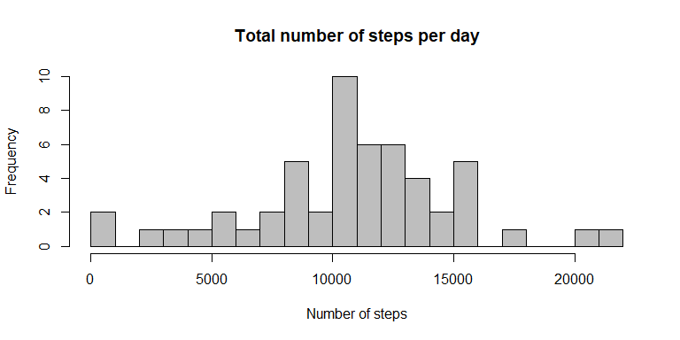
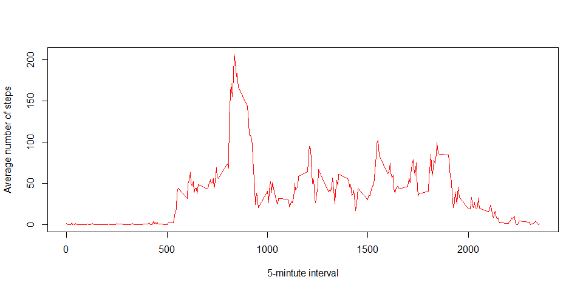
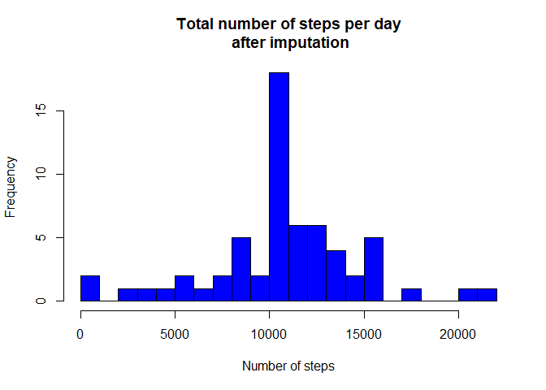
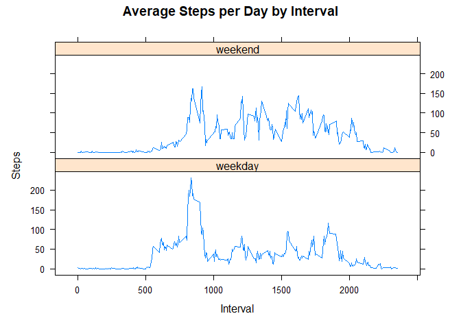

## Loading and preprocessing the data
 1. **Load the data (i.e. <span style="color: red;">read.csv()</span>)**

```r
knitr::opts_chunk$set(echo = TRUE)
 temp <- tempfile()
 download.file("https://github.com/rdpeng/RepData_PeerAssessment1", temp)
 activity <- read.csv("activity.csv")
 str(activity)
```

```
## 'data.frame':	17568 obs. of  3 variables:
##  $ steps   : int  NA NA NA NA NA NA NA NA NA NA ...
##  $ date    : chr  "2012-10-01" "2012-10-01" "2012-10-01" "2012-10-01" ...
##  $ interval: int  0 5 10 15 20 25 30 35 40 45 ...
```
 2. **Process/transform the data (if necessary) into a format suitable for your analysis**. Transform the date from character type to date type.

```r
activity$date <- as.Date(x=activity$date, format = "%Y-%m-%d")
# check now the structure of the data 
str(activity)
```

```
## 'data.frame':	17568 obs. of  3 variables:
##  $ steps   : int  NA NA NA NA NA NA NA NA NA NA ...
##  $ date    : Date, format: "2012-10-01" "2012-10-01" ...
##  $ interval: int  0 5 10 15 20 25 30 35 40 45 ...
```
## What is mean total number of steps taken per day?


```r
activity.com <- activity[complete.cases(activity),]
```
1. Calculate the total number of steps taken per day

```r
total_steps_perday <- tapply(activity.com$steps, activity.com$date, sum)
```
2. Make a histogram of the total number of steps taken each day. 

```r
hist(total_steps_perday, main="Total number of steps per day", 
     xlab="Number of steps", breaks = 20, col="grey")
```

<!-- -->

3. Calculate and report the mean and median of the total number of steps taken per day. 

```r
summary(total_steps_perday)[3:4]
```

```
##   Median     Mean 
## 10765.00 10766.19
```
Another options to compute the mean and median is using the  ```mean ()``` and ```median ()``` functions.  

```r
mean(total_steps_perday)
```

```
## [1] 10766.19
```

```r
median(total_steps_perday)
```

```
## [1] 10765
```

## What is the average daily activity pattern?

1. Make a time series plot (i.e. **<span style="color: red;">type="l"</span>**) of the 5-minute interval (x-axis) and the average number of steps taken, averaged across all days (y-axis). 
We can use the ```aggregate function()``` here. 

```r
av_steps_per_interval <- aggregate(steps ~ interval, data = activity.com, FUN = mean)
plot(av_steps_per_interval$interval, av_steps_per_interval$steps, type = "l", col="red",
     xlab = "5-mintute interval", ylab="Average number of steps")
```

<!-- -->

2. Which 5-minute interval, on average across all the days in the dataset, contains the maximum number of steps?

```r
av_steps_per_interval$interval[which.max(av_steps_per_interval$steps)]
```

```
## [1] 835
```
The **835** 5-minute interval  has the maximum average number of steps across all the days. 

## Imputing missing values

Note that there are a number of days/intervals where there are missing values (coded as **<span style="color: red;">NA</span>**). The presence of missing days may introduce bias into some calculations or summaries of the data.

1. Calculate and report the total number of missing values in the dataset (i.e. the total number of rows with **<span style="color: red;">NA</span>s**)

```r
na.rows <- complete.cases(activity)
sum(!na.rows)
```

```
## [1] 2304
```
The total number of missing values in the dataset is therefore **2304**. 

2. Devise a strategy for filling in all of the missing values in the dataset. The strategy does not need to be sophisticated. For example, you could use the mean/median for that day, or the mean for that 5-minute interval, etc.
**All the missing values in the dataset is found in  the number of steps.** 
We may use a simple strategy to impute the missing values, that is using the *mean* for that 5-minute interval.  

```r
mean_steps_per_interval <- aggregate(steps ~ interval, data = activity.com, FUN = mean)
```
3. Create a new dataset that is equal to the original dataset but with the missing data filled in.

```r
# The imputed data is activity.imputed which has the same dimension as the original data. 
activity.imputed <- activity
na.steps  <- is.na(activity$steps)
val <- na.omit(subset(mean_steps_per_interval, interval == activity$interval[na.steps]))
activity.imputed$steps[na.steps] <- val[, 2]
#To make sure that all the missing values are correctly imputed find the NA values for the imputed data.
sum(!complete.cases(activity.imputed))
```

```
## [1] 0
```

4. Make a histogram of the total number of steps taken each day and Calculate and report the mean and median total number of steps taken per day. Do these values differ from the estimates from the first part of the assignment? What is the impact of imputing missing data on the estimates of the total daily number of steps?

- Histogram of the total number of steps taken per day. 

```r
total_imputed_steps_perday <- tapply(activity.imputed$steps, activity.imputed$date, sum)
hist(total_imputed_steps_perday, main="Total number of steps per day\n after imputation", 
     xlab="Number of steps", breaks = 20, col="blue")
```

<!-- -->

- The mean total number of steps taken per day:
# mean 

```r
mean(total_imputed_steps_perday)
```

```
## [1] 10766.19
```
- The median total number of steps taken per day:

```r
median(total_imputed_steps_perday)
```

```
## [1] 10766.19
```
- **Do these values differ from the estimates from the first part of the assignment?** 

Both estimates (mean and median) are the same in the original and imputed data. Only a slight difference is found for the median estimates. 

- **What is the impact of imputing missing data on the estimates of the total daily number of steps?** 

To answer this question we may use the summary values for the total number of steps in the two datasets:  *total_steps_perday* and  *total_imputed_steps_perday*. 


```r
# Original data
summary(total_steps_perday)
```

```
##    Min. 1st Qu.  Median    Mean 3rd Qu.    Max. 
##      41    8841   10765   10766   13294   21194
```

```r
# Imputed data 
summary(total_imputed_steps_perday)
```

```
##    Min. 1st Qu.  Median    Mean 3rd Qu.    Max. 
##      41    9819   10766   10766   12811   21194
```

```r
# take the difference of the two 
summary(total_imputed_steps_perday) - summary(total_steps_perday)
```

```
##     Min.  1st Qu.   Median     Mean  3rd Qu.     Max. 
##    0.000  978.000    1.189    0.000 -483.000    0.000
```
As we can see form the above two summary values, the impact of imputing missing data on the estimates of the total daily number of steps is on the 1st and 3rd Quartiles.  After imputation the total number of steps per day  increases at the 1st Quartiles, whereas  it decreases at the 3rd Quartiles.   

## Are there differences in activity patterns between weekdays and weekends?

For this part the **<span style="color: red;">weekdays()</span>**  function may be of some help here. Use the dataset with the filled-in missing values for this part.

1. Create a new factor variable in the dataset with two levels – "weekday" and "weekend" indicating whether a given date is a weekday or weekend day.

```r
# list the weekday days 
weekdays <- c("Monday" ,"Tuesday",  "Wednesday",  "Thursday", "Friday")
# create the new variable 
activity.imputed$date_type <- ifelse(weekdays(activity.imputed$date) %in% weekdays, "weekday", "weekend")
# change character to factor type  
activity.imputed$date_type  <- factor(activity.imputed$date_type)
# check the structure of the new variable  
str(activity.imputed$date_type)
```

```
##  Factor w/ 2 levels "weekday","weekend": 1 1 1 1 1 1 1 1 1 1 ...
```

2. Make a panel plot containing a time series plot (i.e. **<span style="color: red;">type="l"</span>**) of the 5-minute interval (x-axis) and the average number of steps taken, averaged across all weekday days or weekend days (y-axis). See the README file in the GitHub repository to see an example of what this plot should look like using simulated data.

```r
# aggregate the number of steps by the interval and the date_type 
mean_imputed_steps_datype <-aggregate(steps~ interval + date_type, data = activity.imputed, FUN = mean)
# lattice package 
library(lattice)
xyplot(mean_imputed_steps_datype$steps ~ mean_imputed_steps_datype$interval|mean_imputed_steps_datype$date_type, main="Average Steps per Day by Interval", xlab="Interval", ylab="Steps",layout=c(1,2), type="l")
```

<!-- -->
